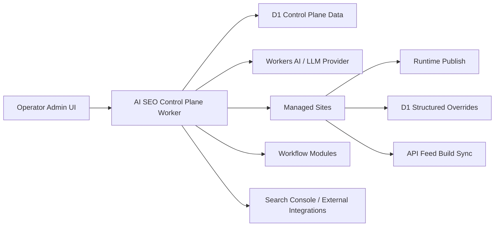
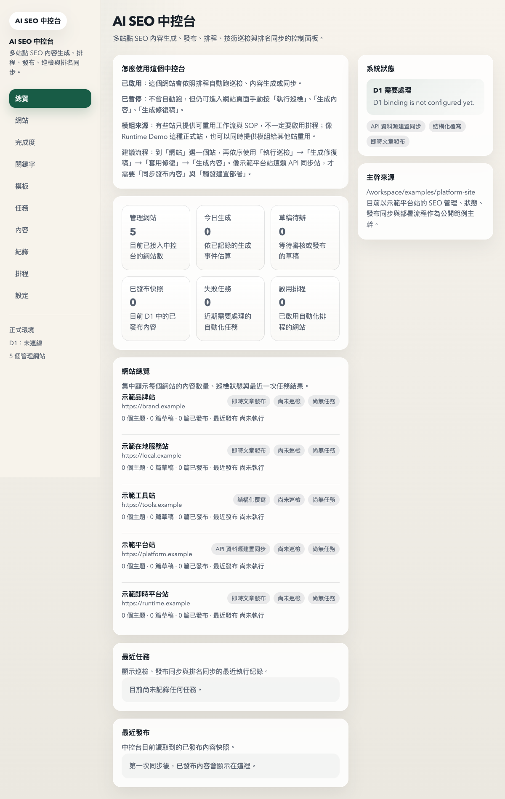
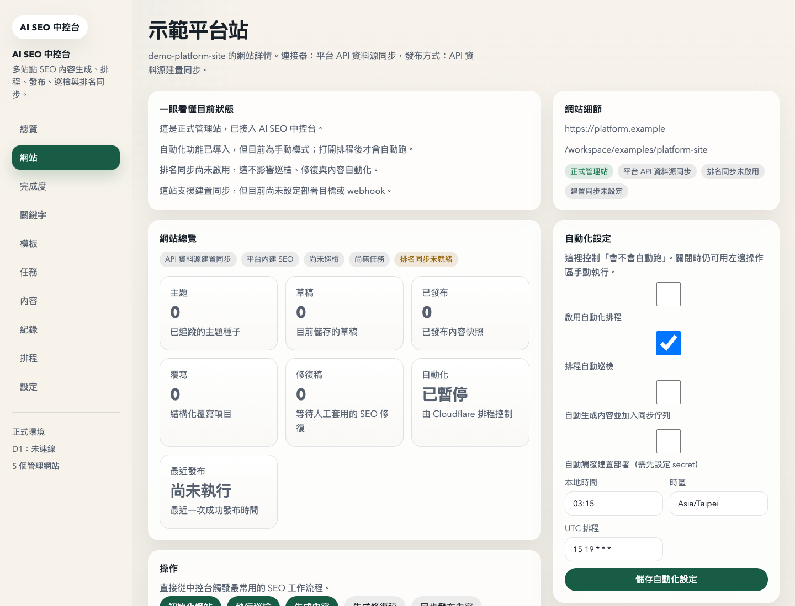
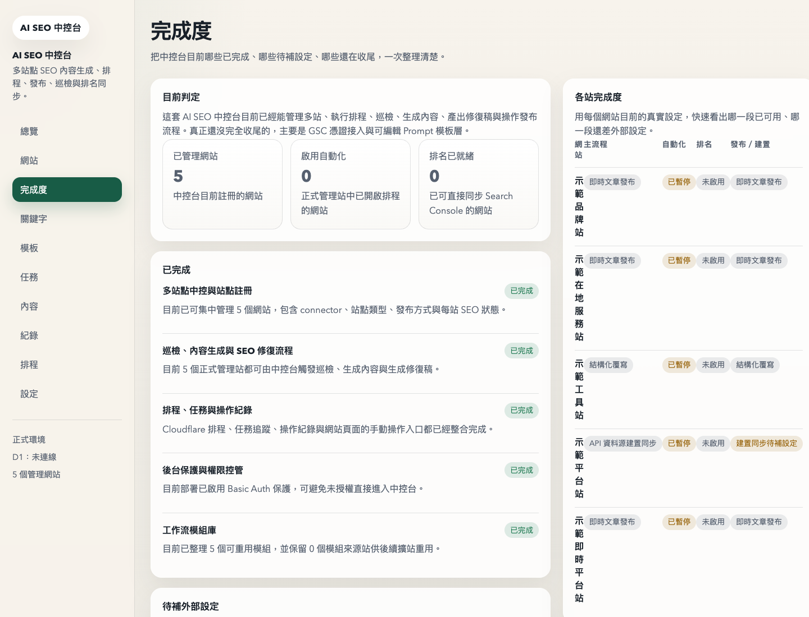

# AI SEO Manager

[](./LICENSE)


AI SEO Manager is an open-source, Cloudflare-first platform for managing AI-powered SEO workflows across multiple websites.

It is being built for small businesses, agencies, independent website operators, and developers who need one place to coordinate keyword planning, topic generation, metadata, structured data suggestions, internal linking, publishing workflows, and SEO automation without adopting a heavyweight enterprise stack.

## What It Aims To Solve

Many teams manage SEO across multiple sites with scattered documents, ad hoc prompts, disconnected CMS workflows, and repeated manual work.

AI SEO Manager is designed to make those workflows more structured and repeatable by centralizing:

- managed site setup
- keyword and topic planning
- AI-assisted SEO content workflows
- technical SEO checks
- publishing and deployment steps
- reusable operating procedures across projects

## Core Product Direction

The project is designed around:

- one control plane
- many managed websites
- one shared SEO data model
- multiple publishing modes
- Cloudflare-native deployment

## Public Source Now Included

The repository now includes a sanitized working source package under [`control-plane/`](/Users/gregg/Documents/ChatGPT/ai-seo-manager/control-plane).

That package includes:

- Cloudflare Worker routes
- D1 migrations
- multi-site connector registry
- admin UI rendering
- audit, content, ranking, repair, and build-sync workflows
- automated tests with sanitized example site data

## Architecture At A Glance



## Interface Preview

Dashboard overview:



Managed site detail:



Readiness checklist:



## Planned Capabilities

- Multi-site SEO project registry
- Connector-based site onboarding
- Keyword and topic database
- AI-generated SEO briefs
- Meta title and description generation
- Structured data suggestions
- Internal link recommendations
- Content gap analysis
- Technical SEO audits
- Repair-oriented workflow support
- Publishing and build-sync orchestration
- Search Console and ranking workflows
- Multi-site scheduling and automation

## Intended Users

- Small business owners
- Independent site operators
- SEO consultants
- Content teams
- Agencies managing multiple websites
- Developers building SEO tools or workflows

## Cloudflare-First Architecture

The initial public architecture is built around Cloudflare services:

- Workers for API and orchestration
- D1 for structured control-plane data
- KV or R2 where content or assets need lightweight storage
- Pages or Worker-based publishing depending on connector type

The platform direction currently assumes support for multiple publishing modes:

- `kv_runtime`
- `d1_override`
- `api_feed_build_sync`

## Why Open Source

This project is based on real operational problems encountered while managing multiple live websites.

The open-source goal is to make AI SEO infrastructure more accessible to:

- small teams without enterprise tooling
- developers who want a composable Cloudflare-based SEO platform
- operators who need practical workflows instead of abstract SEO dashboards

The repository is intended to grow into a clean, contribution-friendly public version with documentation, examples, deployable modules, and community-driven extensions.

## Current Repository Status

This repository is the public OSS scaffold for the project.

It currently contains:

- public project positioning
- architecture and deployment notes
- contribution-friendly structure
- a sanitized `control-plane/` source package extracted for open-source publishing
- OSS application and roadmap documents

The production ideas and workflow patterns come from real internal and multi-project SEO operations, and this public repository will gradually become the canonical open-source implementation.

## Repository Structure

- `docs/` architecture notes, deployment guidance, OSS application notes, and project status
- `frontend/` future operator-facing UI application
- `control-plane/` Cloudflare Worker control-plane service with sanitized example data
- `worker/` minimal Worker scaffold kept for early repository orientation
- `schema/` shared data-model notes and future schema definitions

## Quick Start

```bash
cd control-plane
npm install
npm run dev
```

Then open the local Worker endpoint and verify:

```bash
curl http://127.0.0.1:8787/healthz
```

Useful local checks:

```bash
cd control-plane
npm test
npm run typecheck
```

## Control Plane Highlights

- `src/index.ts`: main Worker routes and API entrypoints
- `src/ui/admin.ts`: Traditional Chinese admin console rendering
- `src/core/`: audit, content generation, ranking, repairs, jobs, onboarding, build sync
- `src/connectors/`: connector contracts, manifest registry, sanitized example seeds
- `migrations/`: D1 schema for multi-site SEO operations
- `test/`: end-to-end route and workflow tests

## Documentation

- [ROADMAP.md](./ROADMAP.md)
- [docs/architecture.md](./docs/architecture.md)
- [docs/cloudflare-deployment.md](./docs/cloudflare-deployment.md)
- [docs/project-status.md](./docs/project-status.md)
- [docs/open-source-application.md](./docs/open-source-application.md)
- [control-plane/README.md](./control-plane/README.md)

## Contributing

Contributions are welcome as the public project structure evolves.

See [CONTRIBUTING.md](./CONTRIBUTING.md).

## License

[MIT](./LICENSE)
