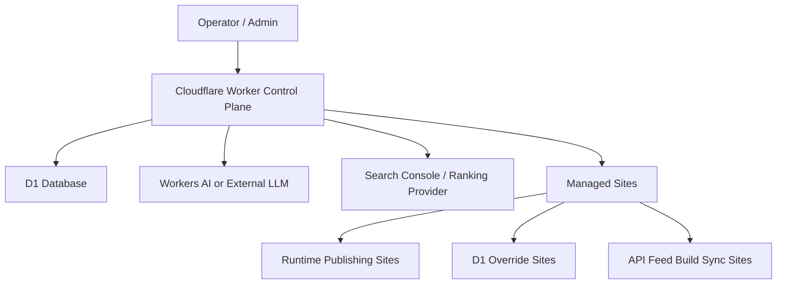

# Architecture

## Product Shape

AI SEO Manager is designed as:

- one control plane
- many managed websites
- one shared SEO data model
- multiple publish adapters

## Runtime Overview

## Main Building Blocks

### Control Plane

The control plane is responsible for:

- managed site registration
- connector-based onboarding
- keyword and topic planning
- SEO workflow state
- audit and repair coordination
- publishing and build-sync orchestration
- ranking sync and workflow-module discovery

### Connectors

Different websites need different publishing models.
The open-source control plane currently demonstrates:

- `kv_runtime`
  Direct runtime publishing for brand sites or product sites
- `d1_override`
  Structured SEO overrides for calculators, directories, or entity pages
- `api_feed_build_sync`
  Published feed output that a downstream app syncs during build or deploy

### Workflow Modules

Reusable modules are treated as portable SEO operating blocks such as:

- technical audit
- content draft generation
- manual publish review
- ranking sync
- repair workflow
- operator playbooks

## Cloudflare-First Direction

The public implementation assumes:

- Cloudflare Workers for orchestration and API routes
- D1 for structured site, topic, job, repair, and ranking state
- optional KV / R2 for site-specific content storage
- Pages or Worker-based delivery depending on the connector type

## Public Package Boundaries

The open-source repo intentionally publishes:

- architecture and implementation patterns
- migrations and Worker source
- sanitized example sites and seeds
- test coverage for core workflows

The public repo intentionally does not publish:

- real customer domains
- private local filesystem paths
- production secrets or service accounts
- business-specific datasets

## Intended Extension Points

The project is meant to stay open to:

- alternative LLM providers
- additional publish adapters
- external CMS inputs
- site-specific routing strategies
- third-party SEO data providers
